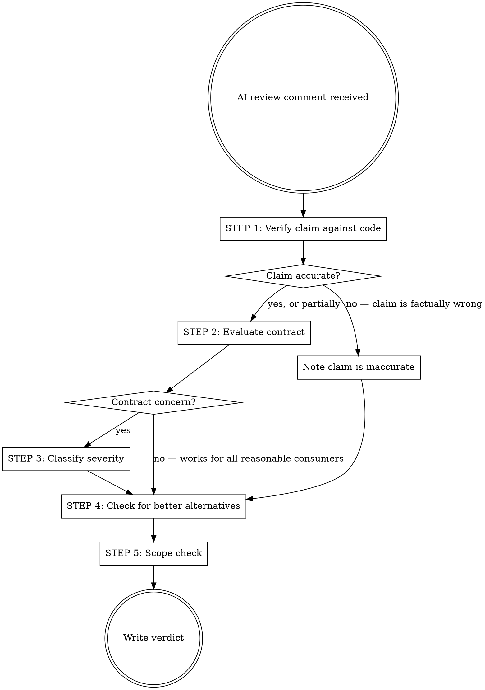

# Evaluate AI PR Review Comments

## Overview

Evaluate each AI review comment as an independent technical claim. Verify against the actual code, evaluate the component's contract for any reasonable consumer, and classify honestly.

**Core principle:** Separate understanding the author's intent from evaluating correctness. "Working as designed" is not a defense if the design is wrong.

## The Evaluation Protocol

For each AI review comment, follow this protocol from Step 1, taking the appropriate branch at each decision point.



### Step 1: Verify the Claim

Read the actual code. Trace the execution path the reviewer describes:

- Does the described behavior actually happen?
- Under what conditions?
- Did the reviewer misunderstand a guard, dependency, or lifecycle?

**Output:** "Claim is accurate / partially accurate / inaccurate" with specific code references.

### Step 2: Evaluate the Contract

**This is where agents fail.** After understanding the author's intent, agents become defenders of the code. Force separation:

| Question            | Defensive (bad)                    | Evaluative (good)                                                      |
| ------------------- | ---------------------------------- | ---------------------------------------------------------------------- |
| "Does it work?"     | "Yes, it's intentional and tested" | "It works for current consumers. For a generic component, consider X." |
| "Is it a bug?"      | "No, the design is explicit"       | "The design handles case A well, but case B is a realistic gap."       |
| "Should we fix it?" | "Not addressing this"              | "The current behavior is acceptable, but a better alternative exists." |

Ask these questions:

- Does this work reliably for **any reasonable consumer**, not just current ones?
- What happens with realistic variations in input size, container dimensions, viewport, data volume?
- Would a new consumer of this component be surprised by this behavior?

### Step 3: Classify Severity

Use this taxonomy — NOT binary "bug or dismiss":

| Verdict           | Meaning                                              | Example                                                                                              |
| ----------------- | ---------------------------------------------------- | ---------------------------------------------------------------------------------------------------- |
| **WRONG**         | Claim is factually incorrect                         | "Infinite loop" when there's an isLoading guard                                                      |
| **VALID BUG**     | Code has a defect that should be fixed               | Off-by-one, null dereference, missing transaction boundary, SQL injection                            |
| **VALID CONCERN** | Design limitation worth discussing                   | N+1 query in a generic repository method, continuous fetch with small page sizes                     |
| **IMPROVEMENT**   | Code works but a strictly better alternative exists  | Using a derived count vs. a direct measure as a React key, select_related instead of manual prefetch |
| **NITPICK**       | Only triggers under genuinely unrealistic conditions | Adversarial inputs, microsecond race conditions                                                      |
| **WON'T FIX**     | Real but acceptable trade-off, already considered    | Known limitation documented in comments                                                              |

**"Nitpick" has a high bar.** Only use when the scenario requires genuinely unrealistic conditions:

- Astronomically large datasets outside the domain
- Adversarial or malformed inputs in internal components
- Race conditions requiring microsecond timing

**These are NOT unrealistic (do NOT classify as nitpick):**

- Small page sizes (5, 10) or tall monitors (1440p, 4K, ultrawide)
- Cache invalidation during pagination or data changes between API calls
- Multiple consumers with different needs for a shared component

### Step 4: Check for Better Alternatives

Even if the current code works, ask: **Is there a strictly better alternative?**

A "strictly better" alternative:

- Handles the same cases as the current code
- Also handles the flagged edge case
- Has zero or near-zero risk of regression
- Doesn't add meaningful complexity

Verdict resolution based on path:

- **Strictly better alternative exists + Step 3 was reached:** keep the Step 3 verdict (it already reflects the concern's severity).
- **Strictly better alternative exists + Step 3 was not reached:** verdict is **IMPROVEMENT** (note any claim inaccuracy in Verification, but classify based on the alternative's merit).
- **No strictly better alternative + Step 3 was reached:** the Step 3 verdict stands.
- **No strictly better alternative + Step 3 was not reached:** use **WRONG** (claim was factually incorrect) or **WON'T FIX** (accurate claim, no contract concern, no action needed).

**Critical: Evaluate the scenario and the suggested fix independently.** A reviewer can describe an inaccurate failure scenario while still suggesting a better alternative:

- The scenario may be wrong — note this
- But the suggested fix may still be strictly better — evaluate it on its own merits
- Do NOT use "the reviewer's scenario is unrealistic" to dismiss a genuinely better alternative

### Step 5: Scope Check

For any verdict that recommends a fix, assess whether it stays within the PR's scope.

**In scope:** only touches files and abstractions the PR already owns.

**Out of scope:** requires changes to shared enums, base models, infrastructure modules, other services or packages not touched by the PR.

Out-of-scope fixes must not be recommended for immediate implementation. Mark them as follow-up work.

## Writing the Response

```markdown
**Verdict:** [WRONG | VALID BUG | VALID CONCERN | IMPROVEMENT | NITPICK | WON'T FIX]

**Verification:** [1-2 sentences on whether the claimed behavior is accurate, with code references]

**Contract evaluation:** [1-2 sentences on whether this matters for reasonable consumers]

**Scope:** [In scope | Out of scope — requires changes to <shared module>]

**Recommendation:** [What to do — dismiss, fix, document, discuss, or adopt the suggested alternative. If out of scope: "follow-up ticket"]
```

Keep responses concise. The verdict and verification do the heavy lifting.

## Defensive Patterns to Watch For

If you catch yourself thinking any of these, STOP — you are rationalizing:

| Rationalization                                      | Reality                                                                                           |
| ---------------------------------------------------- | ------------------------------------------------------------------------------------------------- |
| "This is intentional and tested"                     | Tests prove the author's intent. They don't prove the intent is correct for all consumers.        |
| "This is how Twitter/GitHub/X does it"               | Industry practice doesn't validate your specific component's contract.                            |
| "Not addressing this"                                | Curt dismissal. If the observation is accurate, acknowledge it even if you don't fix it.          |
| "Any reasonable pageSize will..."                    | You're assuming item height, container height, and viewport. The component doesn't control these. |
| "The code is not wrong"                              | "Not wrong" does not mean "optimal." Check for strictly better alternatives.                      |
| "This doesn't affect our use case"                   | A shared component must work for any reasonable consumer.                                         |
| "The reviewer's scenario is unrealistic, so dismiss" | The scenario and the fix are separate things. Rate the fix, not the scenario.                     |
| "Low-priority improvement at best"                   | If a strictly better alternative exists, that's IMPROVEMENT — don't downgrade with qualifiers.    |
| "It's just cosmetic / just for animation"            | Downplaying importance to justify dismissal. Evaluate the alternative on its own merits.          |

**Red flags — you are being defensive:**

- You understood the author's intent and are now arguing FOR the code
- You're reaching for external authority instead of evaluating the specific contract
- You're classifying as "nitpick" without checking if the scenario is truly unrealistic
- You're using "working as designed" as a complete defense
- You're dismissing without acknowledging a better alternative exists
